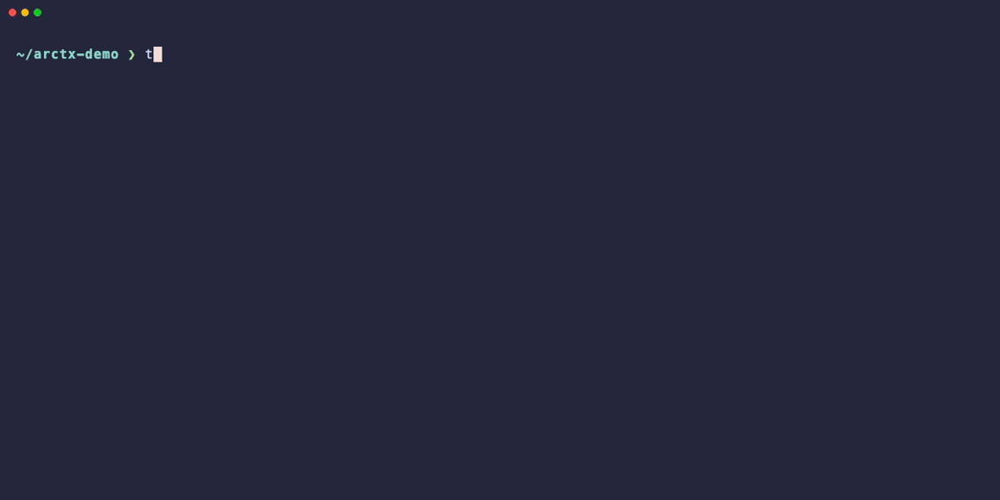

# STAG

**STAG は、思考・作業文脈・並列探索を記録する append-only graph です。**

Git はファイルがどう変わったかを追います。
STAG は作業がどう進んだかを追います。何を試したのか、なぜ試したのか、何が起きたのか、どの分岐を捨てたり合流したりしたのかを記録します。

STAG は agent framework / planner / executor ではありません。
それらの下に置かれる graph layer です。



*2つの AI agent (Claude と Codex) が同じ run に対して並列に作業している様子。それぞれが独立した `work-session` を持ち、両方の branch は同じ `RunGraph` 内の sibling transition として記録されます。race condition も上書きも発生しません。*


*インタラクティブな 3-pane TUI で DAG を歩く: 各 attempt、revert、payload の diff、git の履歴が 1 画面で見渡せます。*

> 0.1 alpha — 破壊的変更があり得ます。モデル整理を優先しており、古い run 保存形式の移行サポートはありません。

*English version: see [README.md](README.md).*

---

## なぜ STAG か

実際の作業は一直線ではありません。仮説を立てる → 試す → 結果を観測する → ある分岐を捨てる → 別の分岐を採る — そして後から「なぜその道を通ったのか」を辿る必要が出てきます。

- Git は **ファイル履歴** — どの commit でどのバイトが変わったか。
- STAG は **reasoning / action / decision の履歴** — どの仮説を試し、どんな結果が出て、どの分岐を切ったか。

STAG はそれら全てを 1 つの append-only DAG として記録します:

- **並列 agent でも衝突しない。** 複数の agent や人間が同じ run を駆動できます。各々独立した work-session を持ち、attempt は sibling transition として並びます。
- **revert しても履歴は残る。** 失敗した書き換えは削除されず、`CutPayload` で inactive とマークされます。何を試したか・なぜ捨てたかをあとから辿れます。
- **commit だけでなく domain payload を載せられる。** benchmark 結果、予測、意図 — 何でも attach できます。各 transition が「何のため」だったかを DAG が知っています。
- **active かどうかは read-time に計算。** 切り捨てた branch は自動で filter されます。履歴を書き換えずに、グラフは綺麗に保たれます。

STAG は executor / planner / agent framework ではありません。それらが「何をしたか・なぜそうしたか」を保存するための基盤です。

---

## どんな時に使うか

- **複数 AI agent / 人間によるソフトウェア作業** — Claude Code、Codex、自作 agent や人間が同じ codebase で作業する場合。各試行が区別され、あとからレビュー可能になります。
- **研究・設計探索** — 仮説を branch させ、結果を payload で残し、捨てた分岐も証拠として保持します。
- **調査・デバッグ** — 仮説と観察結果を payload で記録し、原因にたどり着いた時点で trace を逆向きに歩けます。
- **ベンチマーク駆動の開発** — 「variant A を試す / variant B を試す」が、計測値が attach された transition として記録されます。
- **kernel / 数値最適化** — 上記の一具体例。tiled / vectorize / fuse の試行が sibling transition になり、revert / merge は first-class。

---

## 30 秒で始める

git repository の中で実行してください:

```bash
pip install -e .

stag init my_task --extension git --run-id demo
echo "def f(): pass" > work.py && git add work.py
stag git commit -m "baseline"

stag tui                              # DAG をインタラクティブに探索
stag graph dump --format outline      # もしくは LLM 向け outline でダンプ
```

`stag dump` は `stag graph dump` の互換ショートカットとして残されています。

同じ repo で 2 つの agent を並列に動かしたい場合、それぞれに独立した work-session を発行できます:

```bash
# Claude の端末
eval $(stag work-session env --run demo --new --user claude)
git checkout -b claude/vec
# ...編集...
git add . && stag git commit -m "Claude: vectorization"

# Codex の端末 (同時に動いていてよい)
eval $(stag work-session env --run demo --new --user codex)
git checkout main && git checkout -b codex/map
# ...編集...
git add . && stag git commit -m "Codex: parallel map"
```

両方の branch は同じ `RunGraph` 内の sibling transition として記録されます。実際に動く VHS デモは `examples/demo_cli.tape` と `examples/demo_env.sh` を参照してください。

> **分離スコープの注意。** STAG の `work-session` が分離するのは run / session の履歴・actor attribution (誰がどの session で何をしたか) です。Git の working tree 自体は分離しません — 上記の 2 端末は同じチェックアウトを共有しています。本当に同時編集したい場合は `git worktree` や別の clone を使ってください。Git extension 側で git worktree-aware な workflow を first-class にするのは今後の roadmap です。

---

## 概念 (1 画面)

STAG の中心は **`RunGraph`** — append-only な DAG です。pure な graph 記録は domain data を持たず、domain 固有の情報はすべて **Payload** 側に集約されます。

```text
RunGraph
  ├── Node         ← pure な DAG node
  ├── Transition   ← N 個の input node → 1 個の output node
  ├── Payload      ← Node または Transition に attach する注釈
  └── GraphView    ← 軽量な named scope (root_node_id のみ保持)
```

- 各 **attempt / experiment / action は transition として記録され**、その結果状態が output node になります。
- `NodePayload` / `TransitionPayload` — 汎用の注釈。`type` 文字列で目的を区別します。
- `CutPayload` — append-only な無効化マーカー。対象は削除されず、read-time に filter されます。
- `GitChangePayload` — `git` extension が `stag git commit` のたびに attach する payload。

「この node はまだ生きているか」という activity 判定は、read 時に `RunGraph` と CutPayload から計算されます。store は決して書き換えません。

---

## CLI の主なコマンド

| コマンド | 用途 |
| --- | --- |
| `stag init <req-id>` | 新しい run を作成。`--extension git` で git 統合を有効化。 |
| `stag git commit -m ...` | 実際の `git commit` を実行し、`Transition` と `GitChangePayload` を記録。 |
| `stag work-session env --new --user <name>` | 端末/サブプロセス専用のシェル exports を出力。 |
| `stag transition create` | git なしで transition を追加。 |
| `stag payload add` | 既存 Node / Transition に payload を attach。 |
| `stag graph dump --format outline` | LLM 向けの indented spanning-tree でダンプ。 |
| `stag graph dump --format mermaid` | 人間/ドキュメント向け Mermaid flowchart。 |
| `stag tui` | 3-pane (Runs / Flowchart / Detail) のインタラクティブ TUI。 |
| `stag cut node <id>` | Node (とその下流) を inactive に。append-only。 |
| `stag guide` | 概念をインタラクティブに学ぶ (`--lang ja` で日本語)。 |

`stag dump ...` は `stag graph dump ...` の互換ショートカットとして残されています。

詳細リファレンス: [docs/ja/CLI.md](docs/ja/CLI.md)。

mutating コマンドの run 解決順は `--run` → `STAG_RUN_ID` 環境変数 → カレント git repo の `.stag-id`。user attribution は `--user` → `STAG_USER_ID` → `<STAG_HOME>/config.json` → `"user"`。

---

## Python API

```python
import stag
from stag import NodePayload, Requirement, TransitionPayload
from stag.storage import JsonlRunStore

requirement = Requirement(
    requirement_id="req_demo",
    target_type="task",
    target_id="explore_idea",
)

run = stag.init(requirement, run_id="demo")

transition = run.transition(
    [run.root_node_id],
    TransitionPayload(
        payload_id="pending",
        target_id="pending",
        type="experiment",
        content={"intent": "最初の仮説を試す"},
    ),
)

run.attach(
    transition.output_node_id,
    NodePayload(
        payload_id="pending",
        target_id="pending",
        type="result",
        content={"observation": "promising", "status": "completed"},
    ),
)

history = run.trace(transition.output_node_id)

store = JsonlRunStore("runs")
run.save(store)
loaded = store.load_run("demo")
```

部分集合を切り出して探索したい場合は `GraphView` を作成します。`GraphView` は `root_node_id` のみを保持し、内容は read 時に `RunGraph.reachable_from(root_node_id)` で導出されます。

---

## インストール

Python 3.10 以上が必要です。

```bash
python3 -m pip install -e .            # editable install
python3 -m pip install -e ".[dev]"     # + 開発依存

# インストールせずに repo root から実行する場合:
PYTHONPATH=src python3 -m stag.cli.main ...
```

---

## ストレージレイアウト

`JsonlRunStore` は run を以下のディレクトリ構造で保存します:

```text
<store-dir>/<run-id>/
  run.json
  graph.json
  nodes.jsonl
  transitions.jsonl
  payloads.jsonl
  views.jsonl
  work_sessions.jsonl
  work_events.jsonl
```

`SqliteRunStore` は同じ内容を per-run の `run.db` 1 ファイルにまとめます。デフォルトの store ディレクトリは `<STAG_HOME>/runs`。

0.1 alpha のため、スキーマは破壊的に変わる可能性があります。古い形式からの自動移行はありません。

---

## ドキュメント

- [コンセプト](docs/ja/CONCEPT.md)
- [プロジェクトの方向性](docs/ja/DIRECTION.md)
- [State モデル](docs/ja/STATE_MODEL.md)
- [API](docs/ja/API.md)
- [CLI](docs/ja/CLI.md)
- [問題解決ループ](docs/ja/AGENT_LOOP.md)

English docs: see [docs/en/](docs/en/).

---

## 開発

```bash
PYTHONDONTWRITEBYTECODE=1 PYTHONPATH=src python3 -m pytest tests -q
```

## License

MIT
