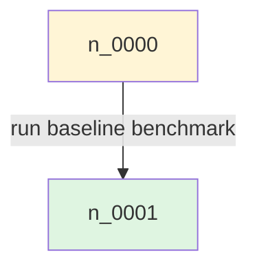

# CLI

STAG CLI は Python API の薄いラッパーです。各 command は `JsonlRunStore` を通じて run をディスクに保存します。

## Install

Python 3.10 以上が必要です。

repo root で editable install すると、`stag` command が使えるようになります。

```bash
python3 -m pip install -e .
```

開発用 dependency も入れる場合は次を使います。

```bash
python3 -m pip install -e ".[dev]"
```

インストールせずに試す場合は、repo root で module として実行します。

```bash
PYTHONPATH=src python3 -m stag.cli.main <subcommand> ...
```

editable install 後は次の形式を使います。

```bash
stag <subcommand> ...
```

## Quick Start

CLI から概念、内部構造、基本ループを確認するには、次を実行します。

```bash
stag guide
```

```bash
stag init req_kernel \
  --target-type kernel \
  --target-id csc_linear \
  --run-id demo

stag plan \
  --run demo \
  --input-node n_0000 \
  --intent "run baseline benchmark"

stag predict \
  --run demo \
  it_0001 \
  --max-outcomes 1

stag observe \
  --run demo \
  it_0001 \
  --matched-prediction ot_0001 \
  --status completed \
  --raw-output raw/profile.txt \
  --metric latency_ms=1.5

stag trace --run demo --from-node n_0002
stag show --run demo
```

## 共通仕様

`--store-dir` の既定値は `.stag/runs` です。

`init` / `use` 以外の command は run を次の順に解決します。

1. `--run`
2. `STAG_RUN_ID`
3. `<store-dir>/../current.json`

mutating command の user attribution は次の順に解決します。

1. `--user`
2. `STAG_USER_ID`
3. `<store-dir>/../config.json` の `user.id`
4. `"user"`

`RunGraph` は run 全体の DAG です。`GraphView` は `root_node_id` だけを持ち、read-time の reachability で内容が決まります。view からの読み取りには `reachable --view` を使います。

## Commands

### `guide`

```bash
stag guide
```

STAG が何を構築しているか、内部の `RunGraph` / transition / payload 構造、基本ループ、主要 command の対応を表示します。LLM や人間に短い利用ガイドを渡したい場合に使います。

日本語で表示したい場合は `stag guide --lang ja` を使います。

### `init`

```bash
stag init <requirement_id> [--target-type code] [--target-id ID] [--run-id RID] [--store-dir DIR]
```

run を作成し、`RunGraph` と `main` view を seed します。root node は `n_0000` です。成功時は run id を出力し、current run も更新します。

### `plan`

```bash
stag plan --input-node n_0000 [--input-node n_0003] [--action-type analysis] [--intent TEXT] [--input k=v] [--assumption TEXT]
```

複数 input node から `InputTransition` を作り、`PlanPayload` を attach します。

### `predict`

```bash
stag predict <input_transition_id> [--max-outcomes 1]
```

同じ `RunGraph` に prediction output の `OutputTransition` を作ります。各 output transition には `PredictionPayload` が attach されます。

### `observe`

```bash
stag observe <input_transition_id> [--matched-prediction <output_transition_id>] [--status completed] [--artifact PATH] [--raw-output PATH] [--log PATH] [--metric k=v] [--error MSG]
```

実行結果を observed output の `OutputTransition` として記録します。新しい output transition に `ResultPayload` が attach されます。

`--matched-prediction` を指定すると、`ResultPayload.matched_prediction_output_id` に prediction output id を保存します。

### `note`

```bash
stag note --node <node_id> --text TEXT [--tag TAG]
```

node に軽いメモとして `NotePayload` を attach します。既存 record は変更しません。

### `cut`

```bash
stag cut --input-transition <input_transition_id> [--reason TEXT]
stag cut --output-transition <output_transition_id> [--reason TEXT]
```

`CutPayload` を attach します。input transition に attach した場合は plan 全体を、output transition に attach した場合はその prediction / result output だけを inactive にします。

### `trace`

```bash
stag trace --from-node <node_id> [--depth N] [--include-predictions]
```

node から過去の履歴を辿ります。デフォルトでは observed output を中心に読みます。prediction output も含めたい場合は `--include-predictions` を使います。

### `outcomes`

```bash
stag outcomes <input_transition_id> [--include-payloads]
```

1つの `InputTransition` に対して、予測 (prediction) / 観測 (observation) / active observation / inactive observation の output transition を分類一覧します。`--include-payloads` を付けると各 output transition の payload も展開します。

### `reachable`

```bash
stag reachable --from-node <node_id> [--include-records]
stag reachable --view <view_name> [--include-records]
```

指定 node または view の root node から forward reachable な active subgraph を表示します。`--from-node` と `--view` は排他でどちらか必須です。`--include-records` で node / transition / payload の実体も返します。

### `show`

```bash
stag show [--node ID | --input-transition ID | --output-transition ID | --payload ID]
              [--with-payloads] [--outputs]
```

引数なしなら run 全体を表示します。個別 ID 指定時は `RunGraph` の global records から探します。

- `--with-payloads`: target record に attach された全 payload を同時表示します。`--payload` とは併用不可です。
- `--outputs`: `--input-transition` 指定時の付加オプションです。全 output transition を kind (prediction/result/unknown) 付きで列挙します。`--with-payloads` と組み合わせると各 output の payload も展開します。`--input-transition` なしではエラーになります。

### `view create`

```bash
stag view create --root-node <node_id> --name <view_name>
```

指定 node を root とする `GraphView` を作ります。view の内容は read-time の reachability で決まります。

### `view list`

```bash
stag view list
```

run 内の view を一覧します。

### `view show`

```bash
stag view show <view_name>
```

view の `root_node_id` と metadata を表示します。

### `dump`

```bash
stag dump [--format outline|mermaid]
              [--node <node_id>]
              [--depth N]
              [--observed-only]
              [--predicted-only]
              [--full-payloads]
```

run 全体を 1 発でレンダリングします。LLM に文脈を渡す場合は `outline`、図として確認する場合は `mermaid` を使います。

**フォーマット**

- `outline`（デフォルト）: インデント付きのスパニングツリー。LLM 向けのテキスト形式です。
- `mermaid`: Mermaid の `flowchart TD` として出力します。Markdown ファイルに貼れる形で返ります。

**オプション**

| オプション | 説明 |
|---|---|
| `--format outline\|mermaid` | 出力形式（省略時は `outline`） |
| `--node <node_id>` | 指定ノードを起点とするサブツリーだけを表示 |
| `--depth N` | 探索の深さ上限 |
| `--observed-only` | prediction output を除外し、observed (result) のみ表示 |
| `--predicted-only` | observed output を除外し、prediction のみ表示 |
| `--full-payloads` | metrics / rationale を省略せず全量表示 |

`--observed-only` と `--predicted-only` は同時指定不可です。

**outline の表記ルール**

```
n_0000  [root]
└─ it_0001  [run baseline benchmark]
    └─→ n_0001  status=completed latency_ms=1.5
        └─ it_0002 (+n_0003)  [merge variant]
            └─→ n_0004  status=completed latency_ms=1.2
    └─⇢ n_0002  latency_ms=1.0
```

- `→` : observed (ResultPayload 付き OutputTransition)
- `⇢` : predicted (PredictionPayload 付き OutputTransition)
- `✂` : cut 済み (inactive)
- `↻n_X` : すでに表示済みノードへの後方参照
- `(+n_X)` : multi-input IT の追加入力ノード
- `▸ feeds it_X (@n_primary)` : non-primary 親ノードからの forward pointer
- `joins (N):` : multi-input IT が 3 個以上の場合に表示されるインデックス

**mermaid の出力例**

````markdown

````

multi-input または multi-output の IT はダイアモンド中間ノードとして展開します。

### `list` / `current` / `use`

```bash
stag list
stag current [--json]
stag use <run_id>
```

run 管理 command です。

## Removed Commands

0.1 の `RunGraph` モデルでは、次の command は廃止します。

```bash
stag extend
stag refresh
stag promote
stag promote-plan
stag promote-transition
stag state
stag snapshot
stag derive
```

`state` / `snapshot` は `SnapshotPayload` の削除に伴って廃止します。`derive` は `DerivedPayload` の削除に伴って廃止します。予測と実測の対応は `observe --matched-prediction ...` で `ResultPayload` に保存します。

## Storage

新形式の run directory は次のファイルを持ちます。

```text
run.json
graph.json
views.jsonl
nodes.jsonl
input_transitions.jsonl
output_transitions.jsonl
payloads.jsonl
```

0.1 alpha では旧 storage schema との互換は持ちません。
